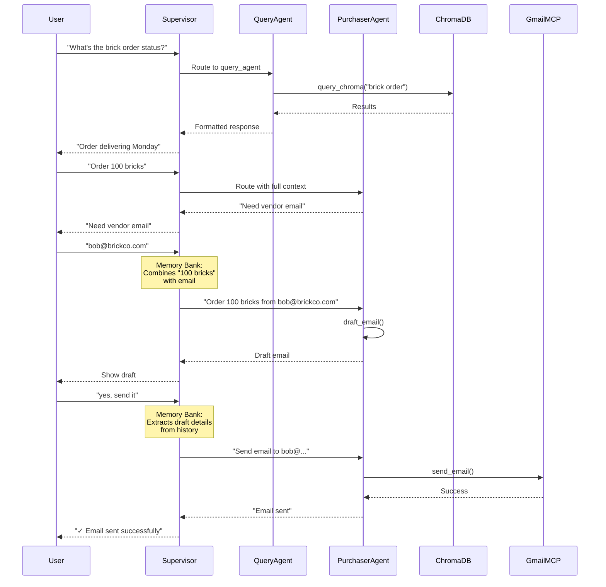

# Construction Procurement Multi-Agent System

**Kaggle Capstone Project - Google ADK Competition**

A production-ready multi-agent AI system for construction procurement that intelligently routes user requests, maintains conversation context, retrieves information via RAG, and sends purchase orders with Human-in-the-Loop approval.

---

## 📋 Problem Statement

Construction Project Managers spend 40% of their time trapped in "Email Jail." 
Construction procurement involves complex workflows:
- Tracking multiple orders, invoices, and communications
- Searching through email history for status updates
- Drafting and sending purchase orders to vendors
- Ensuring human oversight before financial transactions

**Challenges:**
- Information scattered across emails and documents
- Time-consuming manual email searches
- Risk of sending incorrect purchase orders
- Need for audit trails and approval workflows

---

## 💡 Solution

A **multi-agent system** built with Google's Agent Development Kit (ADK) that combines:

1. **Intelligent Routing** - Supervisor agent analyzes intent and delegates to specialists
2. **RAG-based Knowledge Retrieval** - Query agent searches ChromaDB vector database
3. **Human-in-the-Loop Email Automation** - Purchaser agent drafts and sends orders with approval
4. **Memory Bank Architecture** - Supervisor maintains context across stateless sub-agents
5. **MCP Integration** - Gmail Model Context Protocol for real email sending

**Key Innovation:** The "Memory Bank" supervisor pattern solves the stateless sub-agent problem by maintaining conversation context and passing complete, self-contained instructions to specialist agents.

---

## 🏗️ Architecture

### System Overview

```
┌─────────────────────────────────────────────────────────┐
│                   User Input                             │
└────────────────────┬────────────────────────────────────┘
                     │
                     ▼
┌─────────────────────────────────────────────────────────┐
│          Supervisor Agent (root_agent)                   │
│          - Intent Analysis                               │
│          - Context Management (Memory Bank)              │
│          - Agent Orchestration                           │
└────────────┬────────────────────┬────────────────────────┘
             │                    │
    ┌────────▼──────────┐  ┌─────▼──────────────┐
    │  Query Agent      │  │ Purchaser Agent    │
    │  (Information)    │  │ (Transactions)     │
    └────────┬──────────┘  └─────┬──────────────┘
             │                    │
    ┌────────▼──────────┐  ┌─────▼──────────────┐
    │  query_chroma     │  │  draft_email       │
    │  tool             │  │  send_email tools  │
    └────────┬──────────┘  └─────┬──────────────┘
             │                    │
    ┌────────▼──────────┐  ┌─────▼──────────────┐
    │   ChromaDB        │  │   Gmail MCP        │
    │ (Vector Store)    │  │ (Email Service)    │
    └───────────────────┘  └────────────────────┘
```

### Conversation Flow Example

```
User: "What's the status of the brick order?"
  └─> Supervisor: Analyzes intent → Information request
      └─> Calls: query_agent("What's the status of the brick order?")
          └─> Query Agent: Uses query_chroma tool
              └─> ChromaDB: Vector search for "brick order"
              └─> Returns: "Order for 5000 bricks, delivering Monday"
          └─> Returns to Supervisor
      └─> Supervisor: Relays to user
  └─> User sees: "The order for 5000 bricks will be delivered on Monday."

User: "Order 100 more bricks"
  └─> Supervisor: Analyzes intent → Purchase action
      └─> Calls: purchaser_agent("Order 100 more bricks")
          └─> Purchaser Agent: Needs more info
          └─> Returns: "I need the vendor email address"
      └─> Supervisor: Relays to user
  └─> User sees: "I need the vendor email address"

User: "bob@brickco.com"
  └─> Supervisor: **Memory Bank in action**
      - Looks at history: User wants "100 bricks"
      - Combines context: "Order 100 bricks from bob@brickco.com"
      └─> Calls: purchaser_agent("Order 100 bricks from bob@brickco.com")
          └─> Purchaser Agent: Has all details, uses draft_email tool
          └─> Returns: "--- DRAFT EMAIL ---\nTo: bob@brickco.com..."
      └─> Supervisor: Relays exact draft
  └─> User sees: Full email draft

User: "yes, send it"
  └─> Supervisor: **Memory Bank critical**
      - Finds draft in history
      - Extracts: To, Subject, Body
      └─> Calls: purchaser_agent("Send email to bob@brickco.com...")
          └─> Purchaser Agent: Uses send_email tool
              └─> Gmail MCP: Sends email
          └─> Returns: "✓ Email sent successfully"
      └─> Supervisor: Relays confirmation
  └─> User sees: "✓ Email sent successfully via Gmail MCP"
```

### Agent Details

#### 1. Supervisor Agent (`root_agent`)
**File:** `procure_agent/agent.py`

**Responsibilities:**
- Analyze user intent (information vs. action)
- Route to appropriate specialist agent
- **Maintain conversation context** (memory bank)
- Combine multi-turn information
- Extract details from drafts for approval

**Design Pattern:** "Memory Bank" - The supervisor is the ONLY agent with conversation memory. Sub-agents are stateless and receive complete, self-contained instructions every time.

**Tools:**
- `AgentTool(query_agent)` - Information retrieval
- `AgentTool(purchaser_agent)` - Purchase transactions

#### 2. Query Agent (`query_agent`)
**File:** `procure_agent/src/agents/query_agent.py`

**Responsibilities:**
- Search procurement knowledge base
- Return relevant information from past communications
- RAG (Retrieval Augmented Generation)

**Tools:**
- `query_chroma` - Searches ChromaDB vector database

**Behavior:**
- Receives query from supervisor
- Uses query_chroma to search vector store
- Returns formatted results with metadata

#### 3. Purchaser Agent (`purchaser_agent`)
**File:** `procure_agent/src/agents/purchaser_agent.py`

**Responsibilities:**
- Extract purchase details from requests
- Draft email using procurement template
- Send emails after explicit approval
- Human-in-the-Loop safety mechanism

**Tools:**
- `draft_email(recipient, subject, body)` - Creates email preview
- `send_email(recipient, subject, body)` - Sends via Gmail MCP

**Safety Features:**
- **NEVER sends without explicit approval**
- Shows full draft before sending
- Requires "yes", "confirm", or "send it" from user
- Graceful fallback if MCP unavailable

---

## 🛠️ Technical Implementation

### Technologies Used

| Component | Technology | Purpose |
|-----------|-----------|---------|
| **Framework** | Google ADK (Agent Development Kit) | Multi-agent orchestration |
| **LLM** | Gemini 2.0 Flash | Natural language understanding |
| **Vector DB** | ChromaDB | RAG knowledge retrieval |
| **Email Integration** | Gmail MCP (Model Context Protocol) | Real email sending |
| **Data Extraction** | Gemini AI | Parse unstructured emails |
| **Language** | Python 3.11+ | Implementation |

### Key Design Patterns

1. **Supervisor Pattern (Router Pattern)**
   - Central coordinator routes requests to specialists
   - Decouples intent classification from execution

2. **Memory Bank Pattern** (Novel Contribution)
   - Supervisor maintains state for stateless sub-agents
   - Combines multi-turn information before delegation
   - Solves the "amnesia" problem in agent-as-tool architectures

3. **Human-in-the-Loop (HITL)**
   - Critical actions require explicit approval
   - Draft → Review → Approve → Execute workflow
   - Safety mechanism for financial transactions

4. **RAG (Retrieval Augmented Generation)**
   - ChromaDB vector store for email/document search
   - Gemini extracts structured metadata
   - Automatic embedding and semantic search

5. **Agent-as-Tool** (ADK Native)
   - Sub-agents wrapped as tools using `AgentTool()`
   - Clean abstraction and modularity
   - Reusable specialist agents

### Data Flow

**Ingestion (Offline):**
```
Gmail (via MCP) → Gemini (extract metadata) → ChromaDB (vector store)
```

**Query (Online):**
```
User → Supervisor → Query Agent → query_chroma → ChromaDB → Results
```

**Purchase (Online):**
```
User → Supervisor → Purchaser Agent → draft_email → User Approval → send_email → Gmail MCP
```

---

## 📁 Project Structure

```
procure/
├── procure_agent/              # Main agent directory (ADK convention)
│   ├── agent.py                # Root supervisor agent entry point
│   ├── __init__.py             # Package initialization
│   ├── .env                    # Environment variables (API keys)
│   ├── ingest.py               # Email ingestion script
│   │
│   └── src/
│       ├── agents/
│       │   ├── query_agent.py        # RAG information retrieval agent
│       │   └── purchaser_agent.py    # Email automation agent
│       │
│       └── utils/
│           ├── chroma_db.py          # ChromaDB utilities
│           └── mcp_client.py         # Gmail MCP client
│
├── requirements.txt            # Python dependencies
├── README.md                   # This file
└── .gemini/                    # (Artifact directory - not in repo)
```

### File Descriptions

| File | Purpose | Key Functions |
|------|---------|---------------|
| `agent.py` | Supervisor agent with memory bank | Routes requests, maintains context |
| `query_agent.py` | Information retrieval specialist | Searches ChromaDB via RAG |
| `purchaser_agent.py` | Purchase order specialist | Drafts/sends emails with HITL |
| `chroma_db.py` | Vector database utilities | add_documents(), query_collection() |
| `mcp_client.py` | Gmail MCP connection | Async context manager for email ops |
| `ingest.py` | Email ingestion pipeline | Fetch→Extract→Store workflow |

---

## 🚀 Setup Instructions

### Prerequisites

- **Python:** 3.10 or higher
- **Node.js:** Required for Gmail MCP server
- **Google API Key:** For Gemini models

### Installation

1. **Clone the repository:**
   ```bash
   git clone <your-repo-url>
   cd procure
   ```

2. **Install Python dependencies:**
   ```bash
   pip install -r requirements.txt
   ```

3. **Configure environment variables:**
   Create `.env` file in `procure_agent/` directory:
   ```bash
   GOOGLE_API_KEY=your_gemini_api_key_here
   ```

4. **Optional - Gmail MCP Setup:**
   ```bash
   # Install Node.js from https://nodejs.org/
   # No additional config needed - MCP will auto-install on first use
   ```

### Running the System

**1. Ingest Data (First Time):**
```bash
cd procure_agent
python ingest.py
```
This populates ChromaDB with mock procurement emails.

**2. Run the Agent:**

**CLI Mode (Recommended):**
```bash
cd procure_agent
adk run .
```

**Web UI Mode:**
```bash
cd /procure
adk web
```
Then open the browser at `http://localhost:8000`

### Example Usage

**CLI Session:**
```bash
$ adk run .
Running agent supervisor_agent, type exit to exit.

[user]: What's the status of the brick order?
[supervisor_agent]: The order for 5000 bricks will be delivered on Monday, October 30, 2023.

[user]: Order 100 bricks from Bob at bob@brickco.com for $100
[supervisor_agent]: Here is the draft:
--- DRAFT EMAIL ---
To: bob@brickco.com
Subject: Purchase Order - bricks

Dear Supplier,
Please ship 100 of bricks.
Price: $100
Shipping Address: 123 Construction Lane.
Please confirm delivery date.

Thanks,
Construction Manager
-------------------
Does this look correct?

[user]: yes, send it
[supervisor_agent]: ✓ Email sent successfully via Gmail MCP.

[user]: exit
```

---

## 🔧 Configuration & Customization

### Environment Variables

| Variable | Default | Purpose |
|----------|---------|---------|
| `GOOGLE_API_KEY` | (required) | Gemini API authentication |
| `MCP_SERVER_COMMAND` | `npx` | MCP server executable |
| `MCP_SERVER_ARGS` | `-y @modelcontextprotocol/server-gmail` | MCP server arguments |

### Gmail MCP Setup

**For Production Email Sending:**

The system works in demo mode without Gmail authentication. To enable real email sending:

1. Set up Google Cloud Project with Gmail API enabled
2. Create OAuth 2.0 credentials (Desktop application)
3. Configure Gmail MCP with credentials (see Gmail MCP docs)
4. Email will send via MCP; otherwise graceful fallback to demo mode

**Graceful Fallback:**
- If MCP connection fails, system continues in demo mode
- Draft functionality works normally
- "Send" returns success message with note about demo mode

### Configure your Gemini API Key

Get your API key

- If you don't have one already, create an API key in [Google AI Studio](https://aistudio.google.com/app/api-keys).
- Add the google API Key in the .env file
---

## 📊 Architecture Diagrams

### Multi-Agent Communication



### Memory Bank Pattern

```
┌─────────────────────────────────────────┐
│      Supervisor (Stateful)              │
│  - Maintains conversation history       │
│  - Combines multi-turn information      │
│  - Passes complete context each time    │
└─────────┬───────────────────┬───────────┘
          │                   │
    ┌─────▼──────┐     ┌──────▼──────┐
    │Query Agent │     │Purchaser Ag │
    │(Stateless) │     │ (Stateless) │
    └────────────┘     └─────────────┘

    Each call is independent!
    Supervisor provides ALL needed context.
```

---

## 🎯 Competition Requirements Met

### Rubric Alignment

✅ **Multi-Agent System**
- Supervisor agent coordinates two specialist agents
- Router pattern with intelligent delegation
- Agents communicate through supervisor orchestration

✅ **Tools (MCP)**
- Gmail MCP integration for email sending
- Async stdio client connection
- Graceful fallback handling

✅ **Memory**
- ChromaDB vector database for persistent storage
- RAG-based information retrieval
- Conversation context via supervisor memory bank

✅ **Human-in-the-Loop**
- Mandatory approval before sending emails
- Draft preview workflow
- Safety mechanism for financial transactions

✅ **Code Quality**
- Comprehensive inline comments
- Docstrings on all functions
- Design pattern documentation
- Clear separation of concerns

✅ **Documentation**
- Architecture diagrams
- Setup instructions
- Example usage
- Design pattern explanations

---

## 🌟 Novel Contributions

### 1. Memory Bank Pattern

**Problem:** When using `AgentTool()` in ADK, sub-agents are stateless and don't remember previous turns in the conversation.

**Solution:** The supervisor acts as the "memory bank":
- Maintains full conversation history
- Analyzes context before delegation
- Combines multi-turn information
- Passes complete, self-contained instructions to sub-agents

**Impact:** Enables multi-turn workflows (asking for missing info, approvals) in stateless agent architectures.

### 2. Intelligent Context Synthesis

The supervisor doesn't just route - it **understands and transforms**:

```python
# Bad (naive routing):
User: "bob@brickco.com"
Supervisor → Purchaser: "bob@brickco.com"  # Missing context!

# Good (memory bank):
User: "bob@brickco.com"
Supervisor:
  1. Looks at history: User wanted "100 bricks"
  2. Combines: "Order 100 bricks from bob@brickco.com"
  3. Routes complete instruction
Supervisor → Purchaser: "Order 100 bricks from bob@brickco.com"  # Success!
```

### 3. Approval State Management

For Human-in-the-Loop, the supervisor:
- Recognizes approval keywords ("yes", "send it")
- Extracts draft details from conversation history
- Reconstructs complete email parameters
- Passes to purchaser agent for sending

This works around the stateless limitation without requiring persistent storage.

---

## 🧪 Testing

### Automated Testing

```bash
# Test ChromaDB ingestion
cd procure_agent
python ingest.py

# Verify data
python -c "from src.utils.chroma_db import query_collection; print(query_collection('brick'))"
```

### Manual Testing Scenarios

**Scenario 1: Information Retrieval**
```
User: "What invoices do we have?"
Expected: List of invoices from ChromaDB
```

**Scenario 2: Simple Purchase**
```
User: "Order 100 bricks from bob@brickco.com for $50"
Expected: Draft email with all details
User: "send it"
Expected: Email sent confirmation
```

**Scenario 3: Multi-Turn Purchase**
```
User: "Order lumber"
Expected: "I need quantity and vendor email"
User: "100 pieces"
Expected: "I need vendor email"
User: "charlie@woodworks.com"
Expected: Draft email (supervisor combined info)
User: "yes"
Expected: Email sent
```

---

### Manual Testing Results:
```

  super().__init__()
Running agent supervisor_agent, type exit to exit.
[user]: can you order 100 lumber from charlie woodworks
[supervisor_agent]: What is the vendor email?

[user]: charlie@woodworks.com
[supervisor_agent]: Here is the draft:

Dear Supplier,

Please ship 100 of lumber.
Shipping Address: 123 Construction Lane.
Please confirm delivery date.

Thanks,
Construction Manager

Please confirm.

[user]: yes
🔌 Connecting to MCP to send email to charlie@woodworks.com...
[supervisor_agent]: Email sent.

[user]: 
Aborted!
(procure_agent) 
```

## 🚧 Future Enhancements

1. **Enhanced RAG**
   - Multi-modal documents (PDFs, images)
   - Better chunking strategies
   - Reranking for precision

2. **Advanced Workflows**
   - Multi-step approval chains
   - Budget verification
   - Vendor validation

3. **State Persistence**
   - Database for conversation history
   - Draft persistence across sessions
   - Audit logging

4. **Web UI Improvements**
   - Visual draft editor
   - Email template gallery
   - Analytics dashboard

---

## 📄 License

This is a Kaggle Capstone project for educational purposes.

---

## 👤 Authors

Venkata Sai Tarun Katragadda  
Kaggle Username: Tarun Katragadda  
GitHub: Tarun_Katragadda

Venkata Sai Ritesh Katragadda  
Kaggle Username: Katragadda Venkata Sai Ritesh   
GitHub: VenkataSaiRitesh

Yashoda Krishna Srinivasu Bokam
Kaggle Username: Yashodaksb
GitHub: srinivasbyk

Sai Sushanth Tharigopula
Kaggle Username: Sai Sushanth Tharigopula
GitHub: Sushanth Tharigopula

---

## 🙏 Acknowledgments

- **Google ADK Team** - For the excellent agent framework
- **Model Context Protocol (MCP)** - For email integration standard
- **ChromaDB** - For vector database capabilities
- **Gemini Team** - For powerful language models

---

## 📞 Support

For questions or issues:
1. Check the troubleshooting section below
2. Review code comments in `agent.py`
3. Open GitHub issue with error details

### Troubleshooting

**"No module named 'google.adk'"**
```bash
pip install google-adk
```

**"GOOGLE_API_KEY not found"**
- Create `.env` file in `procure_agent/` directory
- Add line: `GOOGLE_API_KEY=your_key_here`

**"Query returns no results"**
- Run `python ingest.py` to populate ChromaDB
- Check `procure_agent/src/utils/chroma_storage/` exists

**"MCP connection failed"**
- This is expected without Gmail OAuth
- System works in demo mode
- Email drafting works normally
- "Send" returns success with demo note

**"Purchaser agent asks for info I already provided"**
- This is expected - sub-agents are stateless
- Supervisor's memory bank should handle this
- Check supervisor instructions in `agent.py`

---

**Built with ❤️ for the Google ADK Kaggle Competition**
